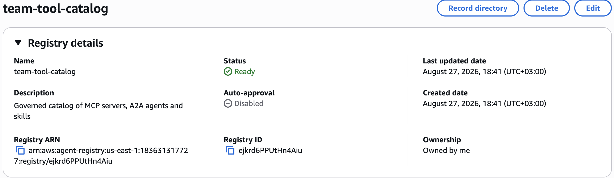
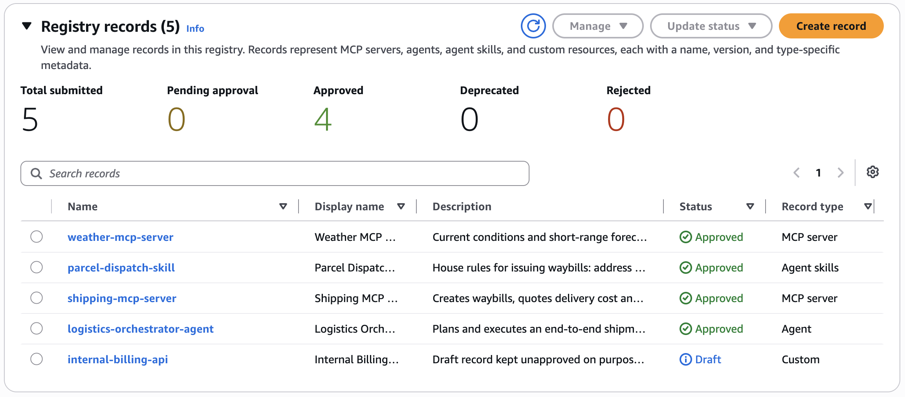
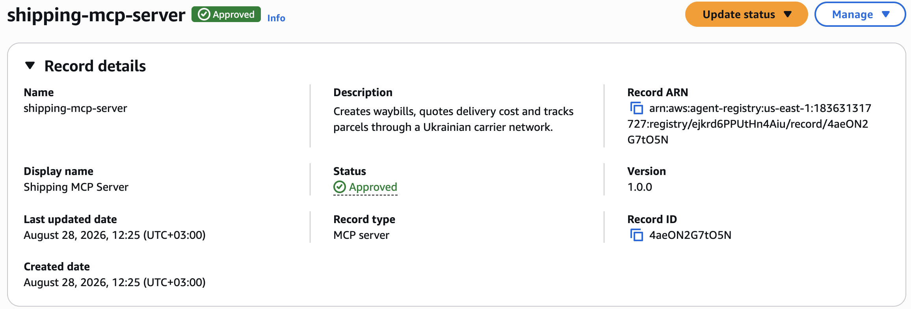
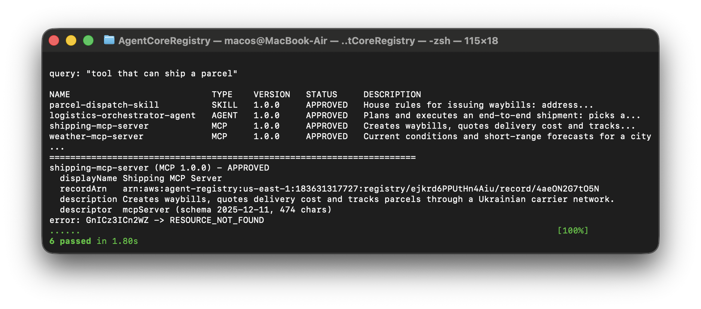

# Governed MCP/Agent Catalog on AWS Agent Registry

A platform-engineering demo: provision a **governed** AWS Agent Registry as code, publish
MCP servers, an A2A agent and a skill through the **Draft -> Submit -> Approve** lifecycle,
and hand consumers a discovery CLI with hybrid semantic search.

Region `us-east-1`, namespaces `agent-registry-control` (control plane) and `agent-registry`
(data plane). No console clicks: the registry, its records and the IAM policies behind them
are all created by scripts in this repository.

## What it demonstrates

- Registry provisioning as code, with **manual approval** rather than auto-publish
- The three registry personas expressed as **IAM policies**, not as function names
- Four record types in one catalog: MCP, A2A Agent, Skill, Custom
- Natural-language discovery: `"tool that can ship a parcel"` ranks the shipping server
  above the weather server with no keyword overlap in the metadata
- A record deliberately left in `DRAFT` that is invisible to consumers **even by direct id**

## Architecture

```
                 Admin                Publisher                 Consumer
                   |                      |                         |
        AgentRegistryDemoAdmin  AgentRegistryDemoPublisher  AgentRegistryDemoConsumer
                   |                      |                         |
        +----------+----------------------+-------+                 |
        |     control plane: agent-registry-control                 |
        |  CreateRegistry, CreateRegistryRecord,                    |
        |  SubmitRegistryRecordForApproval,                         |
        |  UpdateRegistryRecordStatus                               |
        +-----------------------------+-----------------------------+
                                      |
                            +---------v---------+
                            |  team-tool-catalog |
                            |  auth: AWS_IAM     |
                            |  approval: manual  |
                            +---------+---------+
                                      |
                          data plane: agent-registry
                       List / Search / BatchGet Discoverable
                                      |
                                 only APPROVED
```

The governance boundary is not a workflow document. `UpdateRegistryRecordStatus` is absent
from the publisher policy, so a publisher cannot approve its own record. `DeleteRegistryRecord`
is absent too, so it cannot delete a rejection and start over. The data plane exposes three
operations and none of them can reach a non-approved record.

## Repository layout

```
infra/
  registry.py          create / describe / teardown the registry, idempotent
  iam_sync.py          push infra/policies/*.json into IAM as new default versions
  policies/            one policy per persona, plus an annotated README
records/               five record definitions, one deliberately not approved
src/
  publish.py           create -> submit -> approve, and --teardown
  discover.py          consumer CLI: list / search / get
tests/
  test_governance.py   asserts the approved/unapproved discovery boundary
scripts/run_demo.sh    end-to-end run
```

## Run it

```bash
python -m venv .venv && .venv/bin/pip install -r requirements.txt
aws configure --profile agent-registry-demo        # region us-east-1
.venv/bin/python infra/iam_sync.py                 # needs an IAM-write profile
./scripts/run_demo.sh
./scripts/run_demo.sh --teardown
```

`iam_sync.py` defaults to the `default` profile because `agent-registry-demo` deliberately
has no IAM write permission: a scoped identity must not be able to widen its own scope.

## Output

```
$ .venv/bin/python infra/registry.py --describe
name         team-tool-catalog
registryId   ejkrd6PPUtHn4Aiu
status       READY
authorizer   AWS_IAM
autoApproval OFF (manual approval)

$ .venv/bin/python src/publish.py
NAME                           TYPE    VERSION   STATUS            RECORD ID
internal-billing-api           CUSTOM  0.1.0     DRAFT             GnICz3ICn2WZ
logistics-orchestrator-agent   AGENT   1.0.0     APPROVED          nxvA68SPPnLQ
shipping-mcp-server            MCP     1.0.0     APPROVED          4aeON2G7tO5N
parcel-dispatch-skill          SKILL   1.0.0     APPROVED          jqEspnpWlOst
weather-mcp-server             MCP     1.0.0     APPROVED          un7hWWVP3Be1

$ .venv/bin/python src/discover.py search "tool that can ship a parcel"
NAME                           TYPE    VERSION   STATUS     DESCRIPTION
parcel-dispatch-skill          SKILL   1.0.0     APPROVED   House rules for issuing waybills...
logistics-orchestrator-agent   AGENT   1.0.0     APPROVED   Plans and executes an end-to-end shipment...
shipping-mcp-server            MCP     1.0.0     APPROVED   Creates waybills, quotes delivery cost...
weather-mcp-server             MCP     1.0.0     APPROVED   Current conditions and short-range forecasts...

$ .venv/bin/python src/discover.py get 4aeON2G7tO5N GnICz3ICn2WZ
shipping-mcp-server (MCP 1.0.0) - APPROVED
  descriptor  mcpServer (schema 2025-12-11, 474 chars)
error: GnICz3ICn2WZ -> RESOURCE_NOT_FOUND

$ .venv/bin/python -m pytest tests -q
6 passed
```

The last two lines are the point of the whole exercise. The draft record's id is known,
the caller is authorized, and the data plane still answers `RESOURCE_NOT_FOUND`.

## Screenshots

Registry provisioned by `infra/registry.py`. Auto-approval is disabled, so nothing reaches
consumers without a curator decision.



Five records submitted, four approved, one held in `Draft` on purpose.



An approved MCP record with its descriptor and version.



The consumer CLI: semantic search, a batch-get where the draft record's known id returns
`RESOURCE_NOT_FOUND`, and the governance test suite.



## Design decisions

**Manual approval, not auto-approval.** `approvalConfiguration={"autoApprovalRules": []}`.
An empty rule list is what turns the registry from a shared folder into a curated catalog.

**IAM inbound auth over JWT.** JWT requires an identity provider and, on a JWT registry,
neither the SDK nor the CLI can call the discovery APIs - only raw HTTP with a bearer token.
IAM keeps the demo runnable from a clean clone. The JWT path is sketched under "next steps".

**Three policies, one user.** All three persona policies exist as separate managed policies
and are attached to a single demo user. Splitting them across three roles is a five-minute
change (`iam_sync.py` already writes them independently) but adds assume-role noise to a demo.

**Idempotent, not "create once".** Every script converges to the desired state: a second run
reuses the registry and its records instead of failing or duplicating. `clientToken` is a
deterministic `uuid5`, so a retried network call cannot produce a second registry.

**Record definitions are data, not code.** `records/*.json` hold descriptor payloads as real
JSON objects; `publish.py` serialises them to the string form the API expects. The files stay
diffable and lintable instead of being escaped blobs.

## What the documentation does not tell you

Every item below cost a failed run and is why this repository exists rather than a copied tutorial.

**`CreateRegistry` needs permissions in two other namespaces.** It transparently creates a
service-linked role (`iam:CreateServiceLinkedRole`) and a managed workload identity
(`bedrock-agentcore:*WorkloadIdentity*`, still under the pre-rename namespace). AWS reveals
them one failure at a time; an account root caller never sees them at all.

**`.../workload-identity-directory/default/*` does not include `.../default`.** On an account
that has never used AgentCore Identity the directory itself must be created first, so the
documented example fails with `CREATE_FAILED: Unable to create workload identity`. The same
trailing-wildcard trap exists in S3 bucket policies.

**Two of the three failure modes are asynchronous.** `create_registry` returns HTTP 200 and
the resource dies a minute later with the reason in `statusReason`. Any code that proceeds
straight after a `create_*` call, without polling for a terminal status, is working with a ghost.

**`Create*` responses omit the id.** Both `CreateRegistry` and `CreateRegistryRecord` return
only an ARN. The id every subsequent call needs comes from a follow-up lookup.

**`agent_skills` rejects every `dataSchemaVersion`.** Eight candidate values were probed and
all were refused; the descriptor is only accepted when the field is omitted entirely. Skill
markdown must also begin with YAML frontmatter delimited by `---`.

**`clientToken` has a 33-character minimum**, which effectively mandates a UUID rather than a
hand-written string.

## What I would add for production

- **Three IAM roles instead of one user**, with publisher roles scoped per team via
  `Condition` on resource tags, so a team can only submit records it owns
- **EventBridge on record status transitions** into SNS or a Lambda, so approval requests
  reach a curator instead of waiting to be noticed
- **CI that lints `records/*.json`** against the MCP and A2A schemas before they reach AWS,
  moving schema failures from an API round trip to a pull request check
- **URL-based sync** (`source.fromUrl`) so record metadata is pulled from live endpoints
  rather than committed by hand, with drift detection when an endpoint changes
- **Narrower `Resource` ARNs**: policies currently allow `registry/*`; production would pin
  the specific registry ARN, which is available after the first provisioning run
